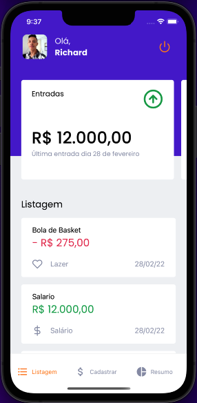
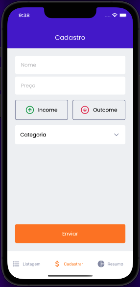
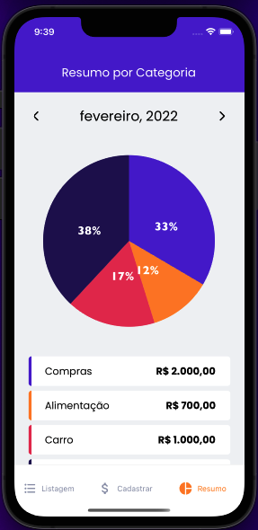

<h1 align="center">

</h1>

# GoFinances

A simple app that will help you organize your finances

## 🔧 Functionality

- You can register your expenses or your earnings quickly and easily.
- You can login with a social login
- You will have a list of your earnings and expenses.
- You will have a summary of your expenses by month,
  in addition to being able to filter them by month

Smartphone Version:

## Done with:

## Screens

Copyright © 2021 Richard Freire

